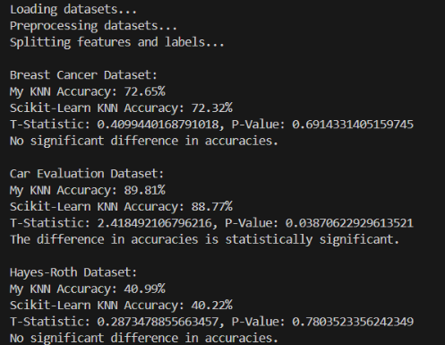

# Custom KNN Implementation

A custom KNN implemented for my Machine Learning Class. 


## Authors

- [@karanlvm](https://www.github.com/karanlvm)


## Run Locally

Clone the project

```bash
  git clone https://github.com/karanlvm/KNN-Implementation.git
```

Go to the project directory

```bash
  cd KNN-Implementation
```

Install dependencies

```bash
  pip install -r requirements.txt
```

Run the code

```bash
  python optimized.py
```


## Results



